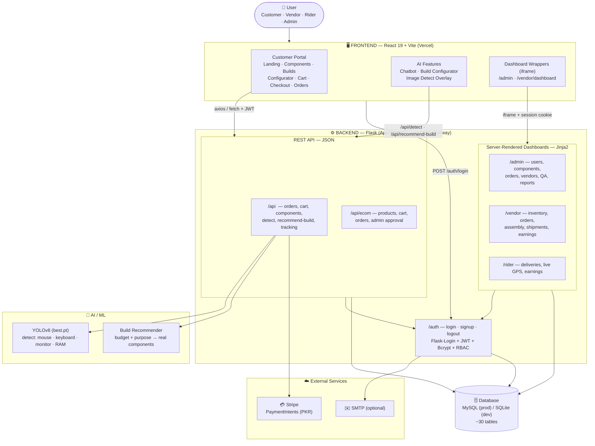
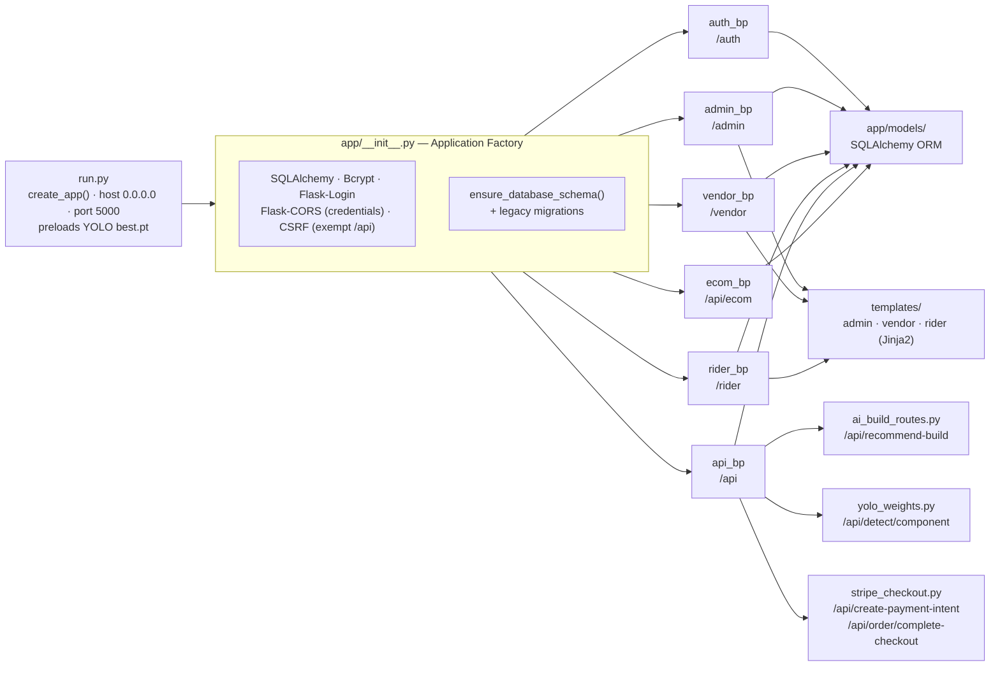
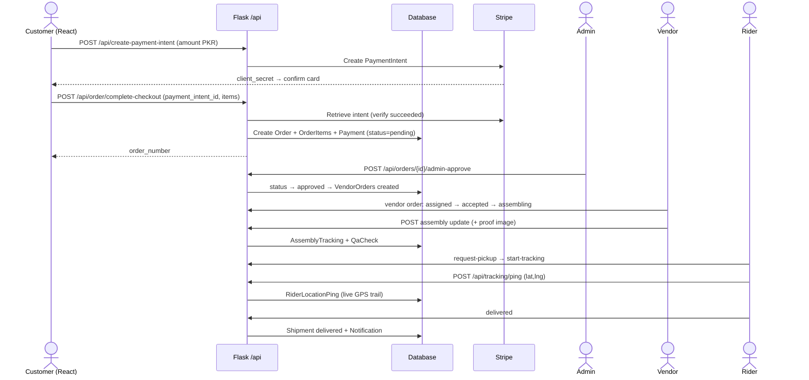
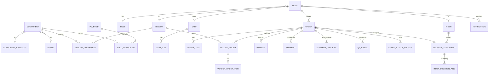
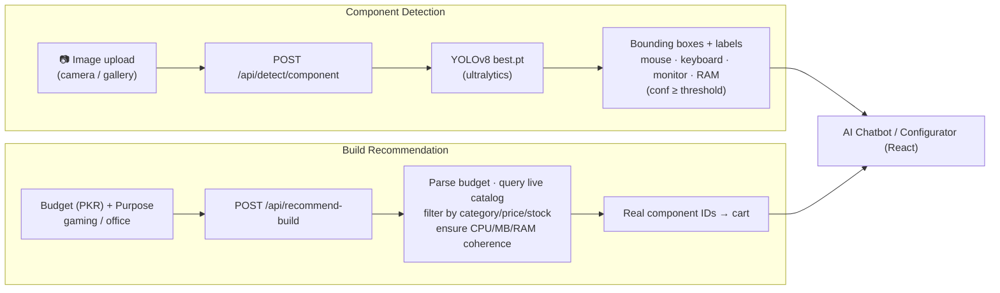
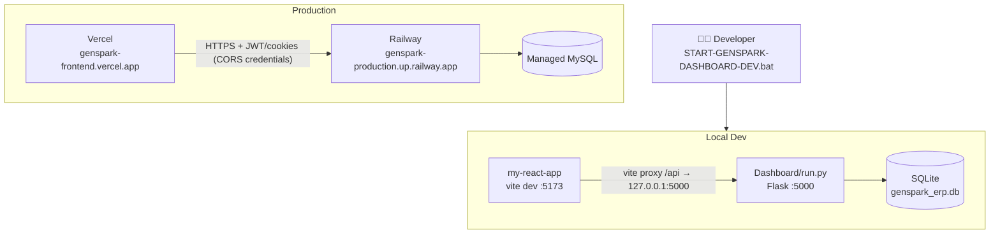
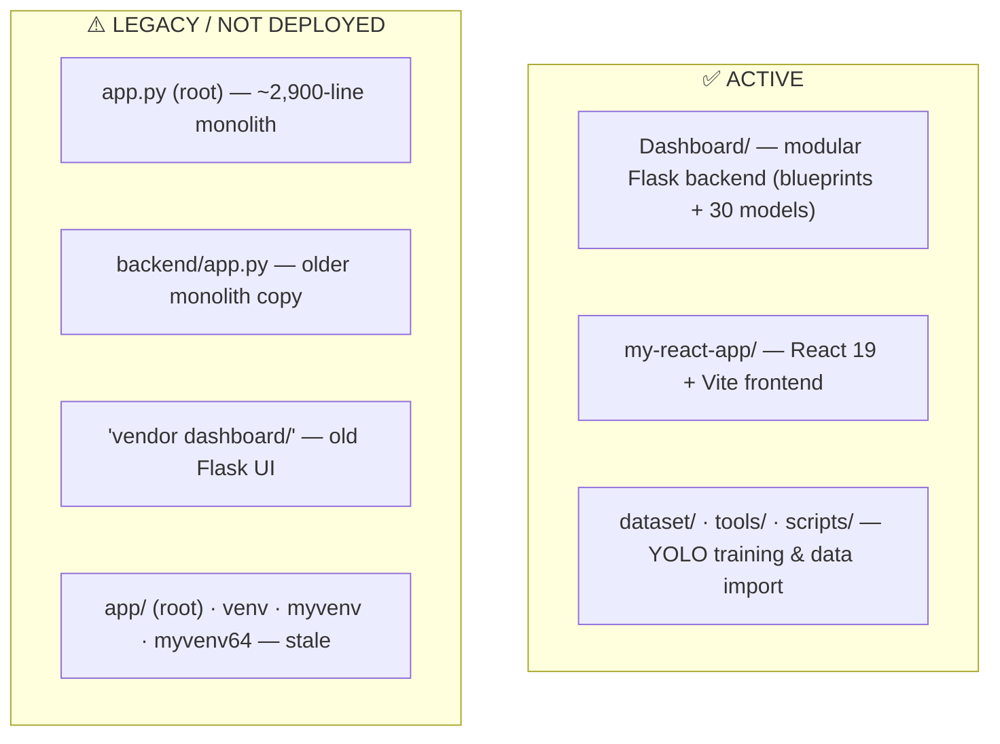

# GenSpark — System Architecture Diagram (Booklet Edition)

> **Project:** GenSpark — AI-powered PC component e-commerce, assembly & delivery platform
> **Stack:** React (Vite) frontend · Flask modular backend · MySQL/SQLite · YOLOv8 vision · Stripe payments
> **Verified against source code** — `Dashboard/` (modular backend) + `my-react-app/` (frontend).

All diagrams below are written in **Mermaid**. They render automatically in GitHub, VS Code (with a Markdown preview / Mermaid extension), and most documentation tools. For a print booklet you can paste any block into [mermaid.live](https://mermaid.live) and export PNG/SVG.

---

## 1. High-Level System Architecture

---

## 2. Backend Module / Blueprint Architecture

Verified from [Dashboard/app/__init__.py](Dashboard/app/__init__.py) (`create_app` factory + blueprint registration).

**Blueprints (verified):**

| Blueprint | Prefix | Responsibility |
|-----------|--------|----------------|
| `auth_bp` | `/auth` | Login / signup / logout, role-based redirect |
| `admin_bp` | `/admin` | Users, components, categories, brands, builds, orders, vendors, QA, reports |
| `vendor_bp` | `/vendor` | Profile, inventory, orders, assembly tracking, shipments, earnings |
| `rider_bp` | `/rider` | Deliveries, live GPS tracking, earnings |
| `api_bp` | `/api` | Orders, cart, component search, YOLO detect, AI recommend, Stripe, tracking |
| `ecom_bp` | `/api/ecom` | Products, cart→approval→order flow, admin order management |

---

## 3. Order Lifecycle — Data Flow (Sequence)

The platform's core multi-actor workflow: customer order → admin approval → vendor assembly → rider delivery.

---

## 4. Database — Entity Relationship (Core Tables)

Verified from [Dashboard/app/models/](Dashboard/app/models/) (~30 models). Showing the core relationships.

> A separate **eCommerce module** (`ecom_*` tables: `EcomProduct`, `EcomCart`, `EcomCartItem`, `EcomOrder`, `EcomOrderItem`) runs the simple shop with a cart→admin-approval→order flow, independent of the component-build pipeline above.

---

## 5. AI / Computer-Vision Pipeline

- **Model:** custom `best.pt` (YOLOv8) trained on 4 PC-peripheral classes; preloaded at startup in [Dashboard/run.py](Dashboard/run.py).
- **Training assets:** `dataset/` (data.yaml + images/labels), training scripts in `tools/`, outputs in `runs/detect/`.

---

## 6. Deployment Topology

| Tier | Local Dev | Production |
|------|-----------|------------|
| Frontend | Vite dev server `:5173` | Vercel |
| Backend | Flask `:5000` (`Dashboard/run.py`) | Railway (gunicorn) |
| Database | SQLite (`genspark_erp.db`) | MySQL (managed) |
| Payments | Stripe test keys | Stripe live keys |

---

## 7. Repository Map — Active vs Legacy

> Documenting this honestly matters for an FYP booklet — the repo contains historical iterations.

**Active architecture (this booklet):** `Dashboard/` (backend) + `my-react-app/` (frontend).
**Legacy / parallel iterations:** root `app.py`, `backend/`, `vendor dashboard/`, old virtualenvs — kept for history, not part of the modular design.

---

## 8. One-Line Summary

> **GenSpark** is a React + Flask platform where customers configure/buy PCs (with **YOLOv8** component detection and **AI budget-based build recommendation**), pay via **Stripe**, and orders flow through a **multi-role pipeline** — Admin approval → Vendor assembly/QA → Rider live-GPS delivery — all backed by a ~30-table MySQL/SQLite schema.

---

*Generated from verified source inspection of `Dashboard/`, `my-react-app/`, models, routes, configs and dev launchers. All blueprints, routes, models, ports, and integrations were read from the actual code, not assumed.*
