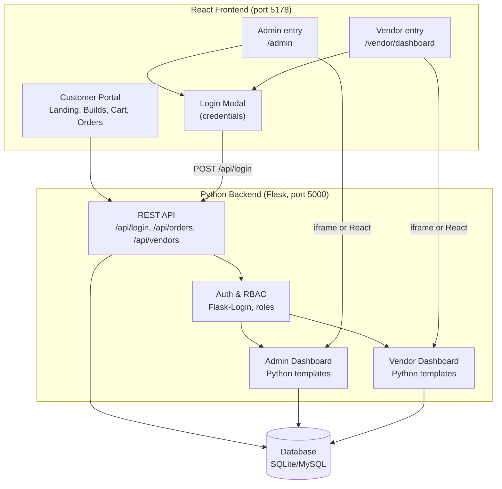

# FYP Project Architecture: React Frontend + Python Backend

Professional architecture for a Final Year Project where **React** handles all customer-facing UI and **Python (Flask)** provides APIs, authentication, role-based access, and (optionally) server-rendered Admin/Vendor dashboards.

---

## 1. High-Level Architecture Diagram

```
┌─────────────────────────────────────────────────────────────────────────────────┐
│                           REACT FRONTEND (Vite, port 5178)                        │
├─────────────────────────────────────────────────────────────────────────────────┤
│  Customer Portal          │  Admin Access        │  Vendor Access                 │
│  • Landing, Builds        │  • Nav: "Admin"      │  • Nav: "Vendor Dashboard"     │
│  • Configurator, Cart     │  • Route: /admin     │  • Route: /vendor/dashboard     │
│  • Order Status, Chatbot  │  • Login modal       │  • Login modal                  │
│                           │  • iframe OR         │  • iframe OR                    │
│                           │    React dashboard   │    React dashboard             │
└───────────────────────────┼─────────────────────┼────────────────────────────────┘
                            │                     │
                            ▼                     ▼
┌─────────────────────────────────────────────────────────────────────────────────┐
│                    PYTHON BACKEND (Flask, port 5000)                             │
├──────────────────────┬──────────────────────┬────────────────────────────────────┤
│  REST API (/api)      │  Auth (session)     │  Server-rendered dashboards         │
│  • POST /api/login    │  • Flask-Login       │  • /auth/login (HTML form)          │
│  • GET  /api/orders   │  • Session cookie    │  • /admin/dashboard (HTML)          │
│  • GET  /api/vendors  │  • Role: admin,      │  • /vendor/dashboard (HTML)         │
│  • GET  /api/...      │    vendor, user     │  • Jinja2 templates                 │
└──────────────────────┴──────────────────────┴────────────────────────────────────┘
                                            │
                                            ▼
┌─────────────────────────────────────────────────────────────────────────────────┐
│                         DATABASE (SQLite / MySQL)                                │
│  Users, Roles, Vendors, Components, Categories, Orders, OrderItems,              │
│  Payments, Shipments, PcBuilds, BuildComponents, etc.                             │
└─────────────────────────────────────────────────────────────────────────────────┘
```

### Mermaid diagram (for GitHub / VS Code)



---

## 2. Responsibility Split

| Layer | Responsibility |
|-------|----------------|
| **React** | All customer UI (landing, builds, configurator, cart, order status, chatbot). Navigation to Admin/Vendor. Login modal for dashboard access. Optional: full React-based Admin/Vendor dashboards. |
| **Python Backend** | REST APIs (JSON). Authentication (session + cookie). Role-based access (admin, vendor, user). Database (SQLAlchemy). Optionally: server-rendered Admin/Vendor HTML dashboards. |
| **Database** | Persistent storage for users, roles, vendors, products/components, orders, payments. |

---

## 3. Making Admin & Vendor Dashboards Accessible from React (No Manual Python URLs)

Users never type `http://localhost:5000/admin/dashboard` manually. Everything is reached from the React app.

### Option A: Current Approach — Iframe + Session (Recommended for FYP)

1. **Single entry from React**
   - Customer opens React app (e.g. `http://localhost:5178`).
   - Header has **Admin** and **Vendor Dashboard** links → React routes `/admin` and `/vendor/dashboard`.

2. **Login in React, session on Python**
   - On `/admin` or `/vendor/dashboard`, a **login modal** opens (or user clicks Login).
   - User submits email/password in the modal.
   - React calls **POST /api/login** (Python) with `credentials: 'include'`.
   - Python validates user, calls `login_user(user)`, returns session cookie.

3. **Dashboard in iframe**
   - On success, React dispatches a custom event (e.g. `flask-admin-login-success`).
   - The Admin (or Vendor) page listens for it and sets the **iframe `src`** to Python’s dashboard URL:
     - Admin: `http://<host>:5000/admin/dashboard`
     - Vendor: `http://<host>:5000/vendor/dashboard`
   - Browser sends the same session cookie to the iframe → Python renders the dashboard (same origin or CORS with credentials).

4. **Result**
   - User stays inside the React app; Admin/Vendor are **embedded** in the same tab. No need to open Python URLs in a new window.

### Option B: Future — Full React Dashboards

- Add React routes like `/admin/*` and `/vendor/*` with their own layouts.
- All data comes from **REST APIs** (e.g. `GET /api/admin/orders`, `GET /api/vendor/orders`).
- Python only exposes JSON APIs; no HTML dashboards. No iframes.

---

## 4. Example Code

### 4.1 Flask base URL (React)

```javascript
// src/utils/flaskBase.js
export function getFlaskBase() {
  const h = typeof window !== 'undefined' ? window.location.hostname : '';
  if (!h) return '';
  return `http://${h}:5000`;
}

export function getFlaskApiLoginUrl() {
  const base = getFlaskBase();
  return base ? `${base}/api/login` : '/api/login';
}

export function getFlaskAdminDashboardUrl() {
  const base = getFlaskBase();
  return base ? `${base}/admin/dashboard` : '/flask/admin/dashboard';
}

export function getFlaskVendorDashboardUrl() {
  const base = getFlaskBase();
  return base ? `${base}/vendor/dashboard` : '/flask/vendor/dashboard';
}
```

### 4.2 Login from React (with role-based event)

```javascript
// In Layout.jsx (or AuthModal callback)
const onFlaskLogin = async (email, password) => {
  const opts = {
    method: 'POST',
    headers: { 'Content-Type': 'application/json' },
    body: JSON.stringify({ email, password }),
    credentials: 'include',
  };
  const res = await fetch(getFlaskApiLoginUrl(), opts);
  const data = await res.json();
  if (!res.ok) throw new Error(data.error || 'Login failed');

  // Role-based: tell the right page to show dashboard
  if (location.pathname === '/vendor/dashboard') {
    window.dispatchEvent(new CustomEvent('flask-vendor-login-success'));
  } else {
    window.dispatchEvent(new CustomEvent('flask-admin-login-success'));
  }
};
```

### 4.3 Role-based dashboard access (iframe)

```jsx
// src/pages/AdminPanel.jsx
const AdminPanel = () => {
  const [iframeSrc, setIframeSrc] = useState(getFlaskLoginUrl());

  useEffect(() => {
    const onSuccess = () => {
      setIframeSrc(getFlaskAdminDashboardUrl());
    };
    window.addEventListener('flask-admin-login-success', onSuccess);
    return () => window.removeEventListener('flask-admin-login-success', onSuccess);
  }, []);

  return (
    <div className="admin-panel-page">
      <iframe title="Admin Dashboard" src={iframeSrc} width="100%" height="900" style={{ border: 'none' }} />
    </div>
  );
};
```

Same pattern for `VendorDashboard.jsx` with `flask-vendor-login-success` and `getFlaskVendorDashboardUrl()`.

### 4.4 Python: Login API and session

```python
# app/api/routes.py
from flask import jsonify, request
from flask_login import login_user

@api_bp.route('/login', methods=['POST', 'OPTIONS'])
def api_login():
    if request.method == 'OPTIONS':
        return '', 204
    data = request.get_json(silent=True) or {}
    email = (data.get('email') or '').strip()
    password = data.get('password') or ''
    if not email or not password:
        return jsonify({'success': False, 'error': 'Email and password required'}), 400
    user = User.query.filter_by(email=email).first()
    if not user or not user.check_password(password):
        return jsonify({'success': False, 'error': 'Invalid email or password'}), 401
    login_user(user)  # session cookie set here
    return jsonify({'success': True, 'message': 'Logged in'})
```

### 4.5 Python: Role-based dashboard (admin)

```python
# app/admin/routes.py
from flask_login import login_required, current_user

def admin_required(f):
    @wraps(f)
    def decorated(*args, **kwargs):
        if not current_user.is_authenticated or not getattr(current_user, 'is_admin', False):
            return redirect(url_for('auth.login'))
        return f(*args, **kwargs)
    return decorated

@admin_bp.route('/dashboard')
@login_required
@admin_required
def dashboard():
    # ... stats from DB
    return render_template('admin/dashboard.html', ...)
```

### 4.6 API fetches from React: orders, vendors, products

```javascript
// Example: fetch orders (React)
const base = getFlaskBase(); // or from flaskBase.js

async function fetchOrders(status = null) {
  let url = `${base}/api/orders`;
  if (status) url += `?status=${encodeURIComponent(status)}`;
  const res = await fetch(url, { credentials: 'include' });
  const data = await res.json();
  if (!data.success) throw new Error(data.error || 'Failed to fetch orders');
  return data.orders;
}

// Example: fetch vendors
async function fetchVendors() {
  const res = await fetch(`${base}/api/vendors`, { credentials: 'include' });
  const data = await res.json();
  if (!data.success) throw new Error(data.error || 'Failed to fetch vendors');
  return data.vendors;
}
```

### 4.7 Python: Orders and vendors API

```python
# app/api/routes.py
@api_bp.route('/orders', methods=['GET'])
def list_orders():
    status = request.args.get('status')
    limit = request.args.get('limit', type=int, default=50)
    query = Order.query.order_by(Order.created_at.desc())
    if status:
        query = query.filter_by(status=status)
    orders = query.limit(limit).all()
    return jsonify({
        'success': True,
        'count': len(orders),
        'orders': [
            {'id': o.id, 'order_number': o.order_number, 'total_amount': float(o.total_amount or 0), 'status': o.status}
            for o in orders
        ]
    })

@api_bp.route('/vendors', methods=['GET'])
def list_vendors():
    vendors = Vendor.query.filter_by(approval_status='approved').order_by(Vendor.shop_name).all()
    return jsonify({
        'success': True,
        'count': len(vendors),
        'vendors': [{'id': v.id, 'shop_name': v.shop_name, 'city': v.city} for v in vendors]
    })
```

Products/components can follow the same pattern (e.g. `GET /api/components` with optional category filter).

---

## 5. Data Flow Summary

| Step | Actor | Action |
|------|--------|--------|
| 1 | User | Opens React app, clicks Admin or Vendor Dashboard. |
| 2 | React | Shows login modal (or iframe with Flask login page). |
| 3 | User | Enters email/password; submits. |
| 4 | React | POST /api/login to Python with `credentials: 'include'`. |
| 5 | Python | Validates user, `login_user(user)`, returns Set-Cookie. |
| 6 | React | On success, dispatches `flask-admin-login-success` or `flask-vendor-login-success`. |
| 7 | AdminPanel / VendorDashboard | Sets iframe `src` to Python dashboard URL. |
| 8 | Browser | Loads dashboard in iframe; sends session cookie → Python renders HTML. |

---

## 6. Integration: Existing Python Dashboards vs React Dashboards

| Approach | Pros | Cons |
|----------|------|------|
| **Iframe (current)** | Reuse existing Flask templates; no rewrite; single login from React; Admin/Vendor accessible from React without opening Python URL manually. | Two UIs (React + Jinja2); session/cookie and CORS must be correct (same host or credentials). |
| **Full React dashboards** | One UI stack; consistent UX; no iframe. | Need to implement all admin/vendor screens in React and expose every action as an API. |

For FYP, the **iframe approach** is enough to show “React handles front-end; Admin/Vendor dashboards are accessible from React without manually opening Python URLs.” Later you can replace iframes with full React dashboards and the same APIs.

---

## 7. File Structure (Reference)

```
vite-react.js/
├── my-react-app/                 # React frontend
│   ├── src/
│   │   ├── App.jsx               # Routes: /, /admin, /vendor/dashboard, ...
│   │   ├── components/
│   │   │   ├── Layout.jsx         # Nav, Admin/Vendor links, AuthModal, onFlaskLogin
│   │   │   └── AuthModal.jsx      # Login form, calls onFlaskLogin when on admin/vendor
│   │   ├── pages/
│   │   │   ├── AdminPanel.jsx     # iframe, listens for flask-admin-login-success
│   │   │   ├── VendorDashboard.jsx
│   │   │   └── ...
│   │   └── utils/
│   │       └── flaskBase.js      # getFlaskBase, getFlaskApiLoginUrl, dashboard URLs
│   └── vite.config.js            # Optional proxy for /api, /flask
│
├── vendor dashboard/             # Python backend
│   ├── run.py                    # Flask app entry, port 5000
│   ├── app/
│   │   ├── __init__.py           # CORS, blueprints: auth, admin, vendor, api
│   │   ├── api/routes.py         # POST /api/login, GET /api/orders, /api/vendors
│   │   ├── auth/routes.py        # /auth/login (HTML)
│   │   ├── admin/routes.py       # /admin/dashboard, @admin_required
│   │   ├── vendor/routes.py      # /vendor/dashboard
│   │   └── templates/            # admin/*.html, vendor/*.html
│   └── init_db.py                # Create admin/vendor users
│
└── FYP_ARCHITECTURE.md           # This document
```

---

## 8. Summary

- **React** = all customer UI + single entry for Admin/Vendor via routes and login modal.
- **Python** = APIs, auth, RBAC, DB; optionally server-rendered Admin/Vendor dashboards.
- **Admin & Vendor** are reachable **from React only**: user clicks Admin/Vendor → logs in in the modal → iframe shows the Python dashboard; no need to open Python URLs manually.
- Example code above covers login, role-based dashboard access (iframe + events), and API fetches for orders and vendors; the same pattern extends to products/components.
